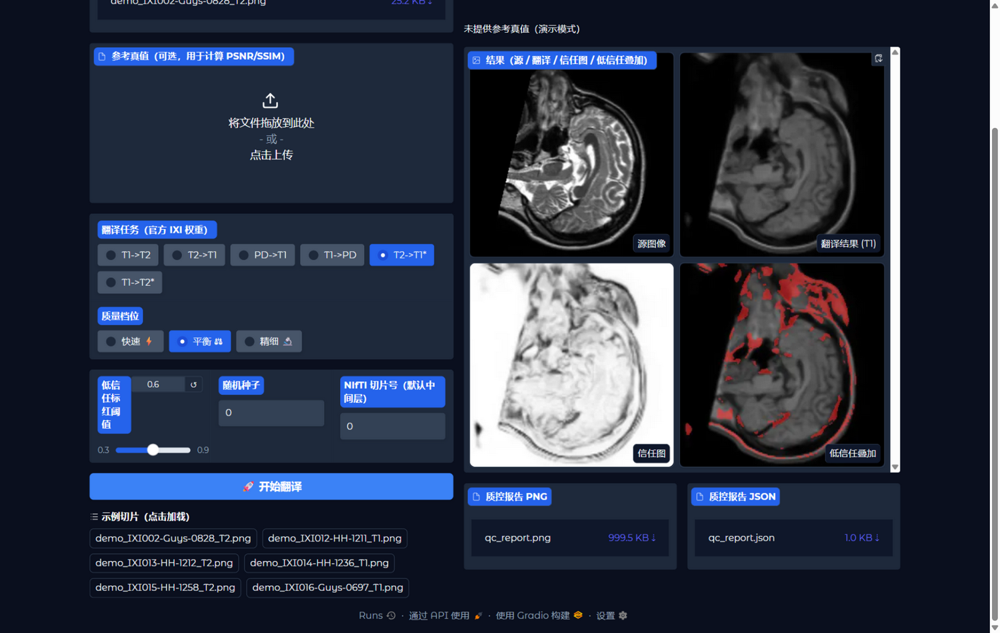
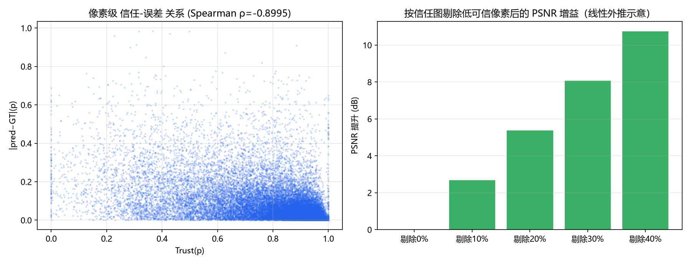

# TrustBridge · 可信医学影像翻译工作台

<p align="center">
  
</p>

**不只合成目标模态，还告诉你哪里可信。**

TrustBridge 是一个本地部署的医学图像翻译应用（脑 MRI 的 T1↔T2↔PD 多对比度互译），
方法基座为 [SelfRDB —— Self-Consistent Recursive Diffusion Bridge](https://arxiv.org/abs/2405.06789)
（[官方代码](https://github.com/icon-lab/SelfRDB)，MIT License），在其自洽递归采样机制之上加入原创的
**可信度量化层**：递归收敛残差场 + 随机桥集成不确定性 → 信任图 / Trust Score / 自动质控报告。

## 为什么做这个

医学图像翻译走向临床的最大障碍不是画质，而是**信任**：合成图像里的幻觉伪影可能误导诊断。
SelfRDB 论文在其讨论部分明确把"扩散桥的不确定性评估"留作未来工作——本项目正是对这一空白的
回应与工程落地。

## 创新点

| # | 创新点 | 说明 | 成本 |
|---|---|---|---|
| ① | 递归收敛残差场 (RCRF) | 捕获反向最后若干步相邻递归估计的**逐像素**残差：网络"反复修改仍不自洽"的区域即幻觉候选区 | 零额外推理成本 |
| ② | 随机桥集成不确定性 | N 次独立桥采样（终点噪声/生成器隐变量不同）取逐像素标准差 | N 倍采样（10 步桥下可负担） |
| ③ | Trust Score 与质控门控 | ①②融合为信任图 → 0-100 分 → PASS/REVIEW/REJECT + PNG/JSON 报告 | 可忽略 |
| ④ | 自适应递归 + 步跳加速 | 快/平衡/精细三档预设，平衡耗时与可信度评估 | 工程优化 |

## 30 秒上手

```bash
git clone https://github.com/<YOUR_USERNAME>/<YOUR_REPO>.git
cd <YOUR_REPO>

# 1) 环境（Windows + NVIDIA GPU；Linux 同理）
pip install torch --index-url https://download.pytorch.org/whl/cu126
pip install -r requirements.txt

# 2) 下载权重（官方权重来自原作者 Release；自训练权重来自本仓库 Release）
bash scripts/download_checkpoints.sh          # 国内直连失败: MIRROR=https://ghproxy.net bash scripts/download_checkpoints.sh

# 3) 启动应用
python app/app.py                             # 浏览器打开 http://127.0.0.1:7860
```

应用里点任意**示例切片** → 选任务 → 选质量档位 → "开始翻译"，即可得到：
翻译结果、信任热图、低信任叠加标注、Trust Score 与可下载的质控报告（PNG+JSON）。

> 想要"解压即用、零安装"的离线版（含便携 Python 运行时，6.4GB）？
> 运行 `python scripts/build_demo_package.py` 自行打包，或见 Release 中的网盘链接。

## 实测结果（IXI 测试集，官方口径评估）

| 模型 | 任务 | PSNR (dB) | SSIM (%) | NCC | 线性强度校正后 PSNR |
|---|---|---|---|---|---|
| SelfRDB 论文值（作者数据制备 / 256² / RTX4090） | T2→T1 | 31.56±1.58 | 95.65±1.18 | – | – |
| **TrustBridge 自训练**（128² / 30ep / 单卡 4060） | T2→T1 | **19.81±1.10** | **71.0±6.6** | **0.884** | **31.74** |
| **TrustBridge 自训练**（128² / 30ep / 单卡 4060） | T1→T2 | **20.44±1.16** | **80.4±4.1** | **0.905** | **32.52** |

**创新点有效性**（测试集 60 切片，N=4 集成，详见 [docs/03](docs/03_复现性排查与验证报告.md)）：

| 指标 | T2→T1 | T1→T2 |
|---|---|---|
| 像素级 Spearman（信任图 vs 真实误差） | **−0.807** | **−0.900** |
| AUROC（低信任像素预测高误差像素） | **0.818±0.065** | **0.900±0.026** |
| 剔除最不可信 20% 像素后的 PSNR 增益 | **+2.81 dB** | **+5.37 dB** |
| 图像级 Trust Score vs PSNR 秩相关 | 0.373 | 0.494 |

<p align="center">
  
</p>

## 从数据到训练（全流程可复现）

```bash
# 1) 获取 IXI 配对数据（T1/T2，约 1.6GB，走 HuggingFace 镜像）
bash scripts/seg_download.sh "https://hf-mirror.com/datasets/Santhosh1884/IXI-Datasets/resolve/main/IXI-T1.tar" 800000000 data/IXI-T1-first800.tar 12
bash scripts/seg_download.sh "https://hf-mirror.com/datasets/Santhosh1884/IXI-Datasets/resolve/main/IXI-T2.tar" 800000000 data/IXI-T2-first800.tar 12

# 2) 配对 + 世界坐标对齐 + 细配准 + 全局强度窗 → 训练/验证/测试切片
python scripts/prepare_ixi.py --n-val 6 --max-sub 40
python scripts/export_slices_v2.py

# 3) 训练（官方 10 步扩散桥配方；单卡 8GB 约 2.5-3 小时）
python scripts/train.py fit --config configs/train_ixi_t2t1.yaml

# 4) 评估与信任图验证
python scripts/eval_test.py --task T2->T1 --ckpt checkpoints/self_t2t1.ckpt --n 150
python scripts/validate_trust.py --task T2->T1 --ckpt checkpoints/self_t2t1.ckpt --split test
```

数据划分：IXI 40 受试者 = train 26 / val 6 / test 8（无受试者重叠）。
T2 经 NIfTI 头文件世界坐标仿射对齐到 T1 网格，并做跨模态细配准（±6px）；
强度协议遵循论文（全卷均值归一 → 全局尺度 C=8.80 → 裁剪 [0,1]）。

## 复现性说明（重要）

官方发布权重在**自备的** IXI 数据上约为 15dB（论文 31.6dB）。我们系统排查了刚性错位、z 偏移、
强度窗、裁剪、离面倾斜等因素，确认差距源于**作者未公开的数据制备细节**（同实验室 SynDiff 仓库
存在同样的[社区报告](https://github.com/icon-lab/SynDiff/issues/53)）。因此本项目：
- 官方权重 → 用于 256² 应用演示（视觉质量良好）；
- **自训练同配方模型 → 承担全部量化验证**，数据制备/训练/评估全流程在本仓库内闭环可复现。
完整排查过程见 [docs/03_复现性排查与验证报告.md](docs/03_复现性排查与验证报告.md)。

## 仓库结构

```
app/            Gradio 应用（中文界面：单图翻译 / 整卷 NIfTI / 关于）
trustbridge/    创新层核心（engine / sampler / pipeline / metrics / report / io_utils）
configs/        训练配置（官方 10 步扩散桥配方）
scripts/        数据准备 / 权重下载 / 训练入口 / 评估与信任图验证 / 离线包构建
third_party/    SelfRDB 官方代码（vendored，仅打兼容补丁，见文件内 TrustBridge patch 标记）
docs/           论文选型与创新点、项目说明书、复现性排查与验证报告
```

## 引用与声明

- 方法基座：F. Arslan, B. Kabas, O. Dalmaz, M. Ozbey, T. Çukur,
  *Self-Consistent Recursive Diffusion Bridge for Medical Image Translation*, arXiv:2405.06789。
  官方代码 MIT License。若本仓库对你有用，请同时引用原论文。
- 数据：[IXI Dataset](https://brain-development.org/ixi-dataset/)（公开科研数据）。
- **免责声明**：合成结果仅供科研与教学演示，不得直接用于临床诊断决策。

## License

本项目新增代码以 MIT License 发布（见 [LICENSE](LICENSE)）；`third_party/SelfRDB`
归原作者所有（MIT），保留其原始许可文件。
